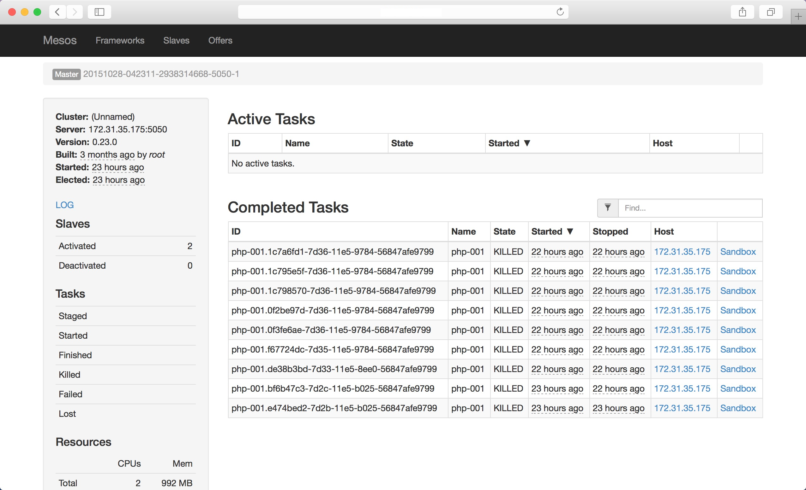
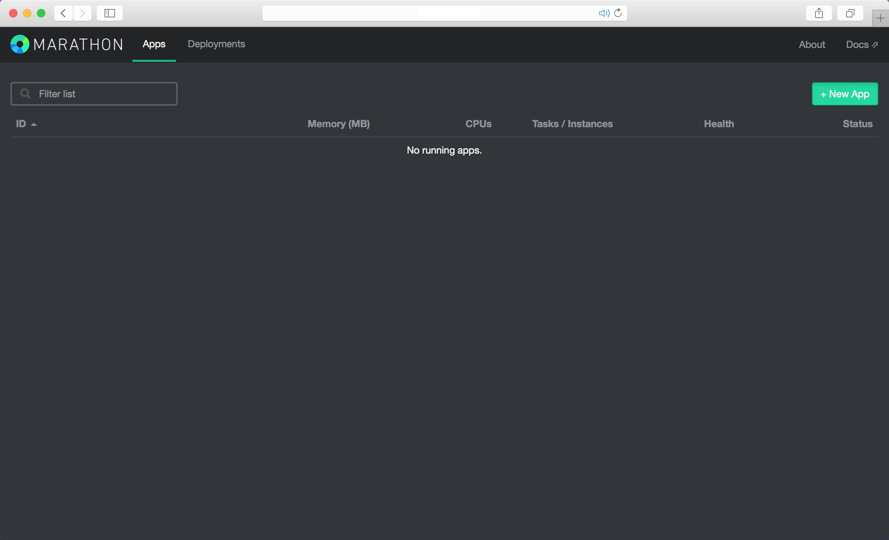
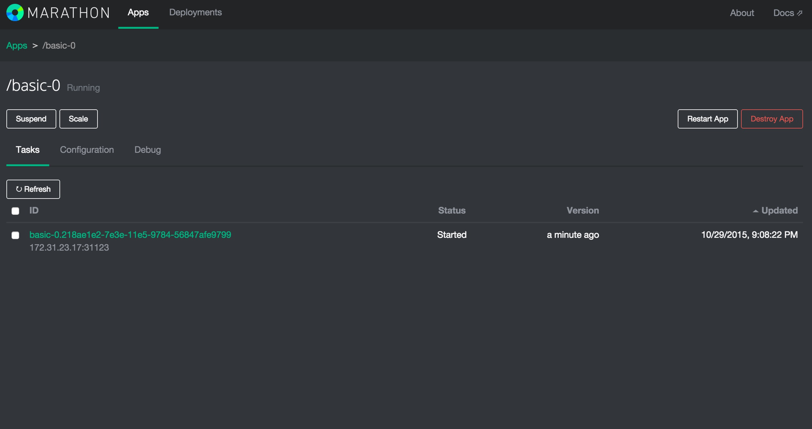
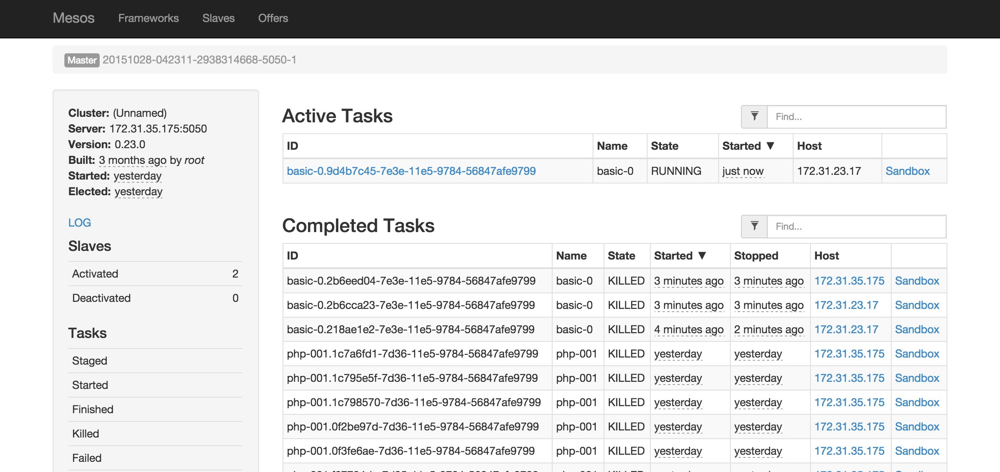

# Marathon Framework 介绍

前面章节已经介绍了Mesos，我们就不再冗余。对于在Mesos上面长时间运行的服务，Mesos提供了Framework来帮助解决调度，健康监控的功能。

每一个运行在Mesos上的容器，都会运行一段时间，对外或者对其他应用提供服务。当启动一个容器的时候，到底这个容器该被分配到Mesos集群上的哪台机器上，运行过程中如果容器异常退出了，能否报告健康状态或者重启这个容器，有些容器在运行中需要公开端口，但是用户没有显示指定，需要系统来动态的决定分配给一个什么端口。上面的这些功能，marathon framework都帮我们做了，下面我们来介绍一下这个framework。

这张图是Marathon官方用来描述Marathon工作状态的一个例子。由于加入了chronos可能显的有些复杂，我们只关心Marathon的部分。(FIXME: re-draw a graph)

首先看到，由于Marathon是Mesos的一个framework，因此他需要运行在Mesos上。当然，运行Mesos需要依赖zookeeper去做选举和一些数据一致性的问题。可以看到，橘黄色部分的任务都是被Marathon启动的，他们被分配到了一个个Mesos slave上面，然后在运行过程中，如果服务宕掉了，Marathon会去重新启动它，保证你服务在一直运行的过程。用户所需要操作的就是向Marathon rest API 发送创建服务请求，剩下的事情Marathon就会帮你做好。

更加具体的信息请参考[Marathon文档](https://mesosphere.github.io/marathon/docs/).下面我们就动手搭建一个简单的Marathon例子来体验一下。

官方文档里面介绍了安装方式是原生安装，我们将会使用docker安装方式，更加快捷方便。

# Mesos容器化安装

在运行Marathon之前，我们需要有一个Mesos环境，作为例子，我们先搭建一个简单的单节点master。Mesos在运行的时候需要master来分配资源和管理salve，而真正干活的则是slave节点。

首先是运行zookeeper，因为Mesos需要使用zookeeper来管理集群。

    docker run -d -e MYID=1 -e SERVERS=172.31.35.175 --name=zookeeper --net=host --restart=always mesoscloud/zookeeper:3.4.6-ubuntu-14.04

我们使用zookeeper 3.4.6版本。`MYID`为当前zookeeper的ID用来在zookeeper集群中标示，`SERVERS`为机器IP，`--net`为网络方式，我们使用host共享宿主机网络方式。 `--restart`是指定当容器异常退出的时候由docker daemon帮助你重启，最后是镜像的名称。

下面来部署Mesos master。

    docker run -d -e MESOS_HOSTNAME=172.31.35.175 -e MESOS_IP=172.31.35.175 -e MESOS_QUORUM=1 -e MESOS_ZK=zk://172.31.35.175:2181/mesos --name mesos-master --net host --restart always mesoscloud/mesos-master:0.23.0-ubuntu-14.04

这个参数比较多，我们来一一解释一下。

  - `MESOS_HOSTNAME`是用来指定当前Mesos master的主机名
  - `MESOS_IP`是当前机器的IP
  - `MESOS_QUORUM`为mesos master的数量，当前为单节点，后面我们会使用高可用模式。
  - `MESOS_ZK`是zookeeper的地址，mesos用来向其中写入数据来保证一致性。

后面的参数前面已经说过了，都是类似的。

Mesos的master有了，那么下面就是干活的slave了。你可以将slave部署到一台新的机器上，也可以部署在和master的同一台机器上，由于我们只是使用一下Marathon的例子，不需要特别的复杂，因此可以将slave部署在一台机器上。

    docker run -d -e MESOS_HOSTNAME=172.31.35.175 -e MESOS_IP=172.31.35.175 -e MESOS_MASTER=zk://172.31.35.175:2181/mesos -v /sys/fs/cgroup:/sys/fs/cgroup -v /var/run/docker.sock:/var/run/docker.sock --name mesos-slave --net host --privileged --restart always mesoscloud/mesos-slave:0.23.0-ubuntu-14.04

slave的参数也不少，前面两个MESOS_HOSTNAME和 MESOS_IP是指你部署这个salve所在机器的IP，MESOS_MASTER是指zookeeper所在服务器的地址，mesos通过这个节点去寻找master通信，zookeeper可以保证master的可用性。（FIXME：这里就一个 master，zookeeper 无能为力，实战最好还是介绍下 multiple node 的情况）

后面的参数就有些复杂。`-v`是docker挂载vloumn的命令，可以将宿主机的磁盘内容挂载到容器内部的指定位置。这里挂载了`cgroup`和`docker.sock`。原因是docker需要使用cgroup来实现容器隔离，而docker.sock是docker daemon通信的通道。将这两个目录挂载到容器里面，这样运行在容器里面的mesos slave就可以通过他们来管理宿主机的docker daemon从而实现在宿主机上启动和管理容器。

这里面有一个新的参数，`privileged`。 默认情况下，docker的privileged是关闭的。目的是为了限制容器内部去访问宿主机的设备。比如你想在容器内部运行一个docker daemon默认情况下就是不支持的。如果你设置了`privileged`，那么容器就能去接触到宿主机的所有设备，这里设置 `privileged` 选项是因为 mesos-slave 需要执行一些特权操作，例如：控制 cgroups。

这样一个mesos环境就搭建好了，可以访问一下IP:5050看一下效果。mesos默认开启5050端口提供浏览器访问。
你的页面应该和这个类似，左侧是mesos集群的一些信息，右侧为目前正在运行的任务和已经运行完毕的任务，如果你没有运行过，那么就不会有记录。

# Marathon环境搭建

通过前面的步骤，我们已经有了一个可用的Mesos集群环境，那么下面我们就可以在这个环境下运行Marathon framework了。

    docker run -d -e MARATHON_HOSTNAME=172.31.35.175 -e MARATHON_HTTPS_ADDRESS=172.31.35.175 -e MARATHON_HTTP_ADDRESS=172.31.35.175 -e MARATHON_MASTER=zk://172.31.35.175:2181/mesos -e MARATHON_ZK=zk://172.31.35.175:2181/marathon --name marathonv0.11.1 --net host --restart always mesosphere/marathon:v0.11.1

Marathon的参数也是比较多的。`MARATHON_HOSTNAME`是部署Marathon本机的IP。`MARATHON_HTTPS_ADDRESS`是部署Marathon的机器IP。`MARATHON_MASTER`为mesos所在zookeeper的节点，因为Marathon作为一个framework需要注册到mesos上。`MARATHON_ZK`为Marathon所在zookeeper的节点。

这样我们就安装好了Marathon环境，使用浏览器请求一下Marathon所在IP：8080看一下效果。

这样Marathon的环境就搭建好了。我们可以使用右上角的New App来创建一个简单的应用。

    {
        "id": "basic-0",
        "cmd": "while [ true ] ; do echo 'Hello Marathon' ; sleep 5 ; done",
        "cpus": 0.1,
        "mem": 10.0,
        "instances": 1
    }

只需要在弹出框里面填写上对应的信息即可。

在这里你就可以看到运行的效果，这样就代表运行成功，Marathon给这个实例分配了机器资源，他就成功的运行在了mesos集群中。

我们也可以访问5050端口，在mesos控制台信息里面，也可以看到正在运行的任务。

