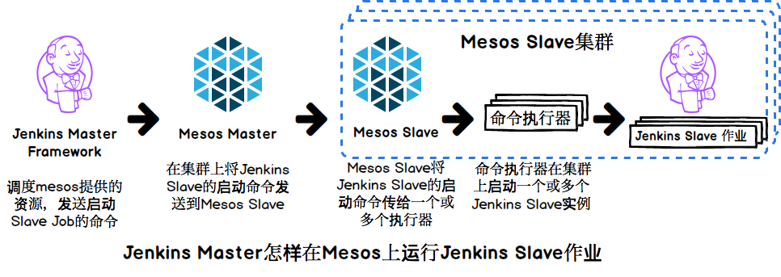

# 7.3 Jenkins

在上一章提到的常用CI工具中，Jenkins 常用的CI开源工具。 其官方网站对 Jenkins 是这样定义的：

> Jenkins 是一个[获奖无数](https://wiki.jenkins-ci.org/display/JENKINS/Awards)的，能够提高你产出的，跨平台的持续集成与持续交付工具。 通过使用 Jenkins 来不间断的构建，测试你的项目，可以更方便的把开发者的 changes 集成到项目中，更快的向用户交付最新的构建。 同时，通过提供接口来定义构建流程，集成多种测试和部署技巧， Jenkins 也可以帮助你持续的交付软件。

Jenkins 以其

* 易于安装：只要把 jenkins.war 部署到 Servlet 容器，不需要数据库支持。
* 易于配置：所有配置都是通过其提供的 Web 界面实现。
* 丰富的插件生态
* 可扩展性：支持扩展插件，你可以开发适合自己团队使用的工具。
* 分布式构建：Jenkins 能够让多台计算机一起构建/测试。
* 集成 RSS/E-mail： 通过 RSS 发布构建结果或当构建完成时通过 E-mail 通知。
* 生成 JUnit/TestNG 测试报告。
* 文件识别: Jenkins 能够跟踪哪次构建生成哪些 jar ，哪次构建使用哪个版本的 jar 等。

等特性广受开发者欢迎。 许多的公司，开源项目都在使用 Jenkins ，譬如 github, yahoo!, Dell, LinkedIn, eBay 等， 你在这里可以看到[Who is using Jenkins](https://wiki.jenkins-ci.org/pages/viewpage.action?pageId=58001258)。

### 7.3.1 为什么要把Jenkins运行到Apache Mesos上

  把 Jenkins 运行到 Apache Mesos 上，或者说利用 Apache Mesos 向 Jenkins 提供 slave 资源，最主要的目的是利用 Mesos 的弹性资源分配来提高资源利用率。通过配置**Jenkins-on-Mesos**插件，Jenkins Master 可以在作业构建时根据实际需要动态的向 Mesos 申请 slave 节点，并在构建完成的一段时间后将节点归还给 mesos。

  同时，Marathon 会对发布到它之上的应用程序进行健康检查，从而在应用程序由于某些原因意外崩溃后自动重启该应用。这样，选择利用 Marathon 管理 Jenkins Master 保证了该构建系统的全局高可用。而且，Jenkins Master本身也通过 Marathon 部署运行在 Mesos 资源池内，进一步实现了资源共享，提高了资源利用率。

 下面两张图形象的说明了 Marathon 将 Jenkins Master 部署到 Mesos 资源池(图7-3-1)，以及 Jenkins Master 使用 Mesos 资源池进行作业构建的整个过程(图7-3-2)。 

  
  &#8195;&#8195;&#8195;&#8195;&#8195;&#8195;&#8195;&#8195;&#8195;&#8195;图7-3-1  Marathon 运行 Jenkins Master
  
  
  &#8195;&#8195;&#8195;&#8195;&#8195;&#8195;&#8195;&#8195;&#8195;&#8195;图7-3-2  Jenkins 使用 Mesos 资源池