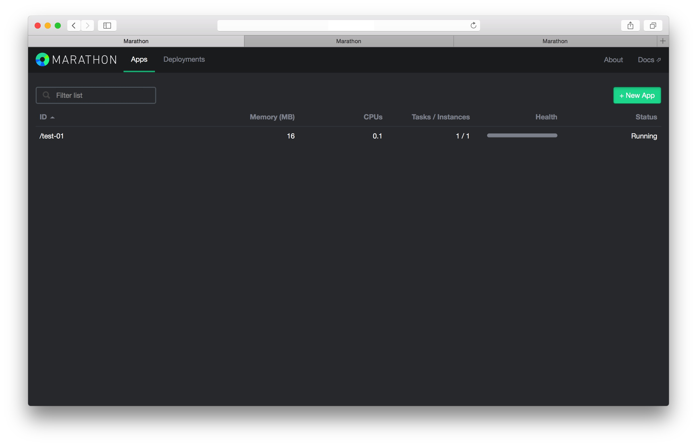
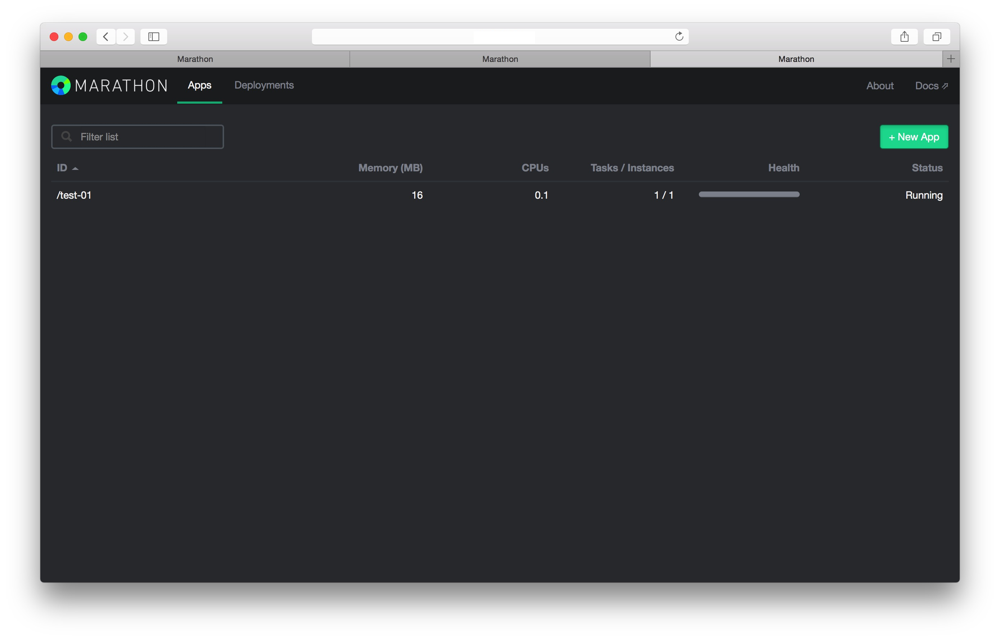

# 容器云搭建

本章我们将开始真正的环境搭建。

提前声明，在整个项目中，我们使用四台服务器。

    Node1 : 172.31.35.175
    Node2 : 172.31.23.17
    Node3 : 172.31.40.200
    Node4 : 172.31.37.173

#zookeeper 集群
前面章节我们搭建的zookeeper是单点的，这里我们需要搭建一个zookeeper集群，这里我们先搭建一个拥有三个节点的zookeeper集群。

首先在Node1上：

    docker run -d -e MYID=1 -e SERVERS=172.31.35.175,172.31.23.17,172.31.40.200 --name=zookeeper --net=host --restart=always mesoscloud/zookeeper:3.4.6-ubuntu-14.04
    
其中的参数，`MYID`为zookeeper集群中的唯一值，用来确定当前节点在集群中的ID。`SERVERS`为指定当前集群每个zookeeper节点所在服务器的IP。

然后在Node2上：

    docker run -d -e MYID=2 -e SERVERS=172.31.35.175,172.31.23.17,172.31.40.200 --name=zookeeper --net=host --restart=always mesoscloud/zookeeper:3.4.6-ubuntu-14.04
    
Node3:
    
    docker run -d -e MYID=3 -e SERVERS=172.31.35.175,172.31.23.17,172.31.40.200 --name=zookeeper --net=host --restart=always mesoscloud/zookeeper:3.4.6-ubuntu-14.04

启动完毕后，我们进入各个机器的容器查看zookeeper启动情况。

    root@ip-172-31-23-17:/opt/zookeeper/bin# ./zkServer.sh status
    JMX enabled by default
    Using config: /opt/zookeeper/bin/../conf/zoo.cfg
    Mode: leader
    
    root@ip-172-31-35-175:/opt/zookeeper/bin# ./zkServer.sh status
    JMX enabled by default
    Using config: /opt/zookeeper/bin/../conf/zoo.cfg
    Mode: follower
    
    root@ip-172-31-40-200:/opt/zookeeper/bin# ./zkServer.sh status
    JMX enabled by default
    Using config: /opt/zookeeper/bin/../conf/zoo.cfg
    Mode: follower

可以看到，`172.31.23.17`为leader，其他的为follower，这样zookeeper集群就搭建完毕了。

#Mesos 集群搭建
前面章节我们搭建的mesos集群都是单master节点，生产环境下一定是需要HA的。因此我们这里搭建一个三个master节点的mesos集群。

    docker run -d -e MESOS_HOSTNAME=172.31.35.175 -e MESOS_IP=172.31.35.175 -e MESOS_QUORUM=2 -e MESOS_ZK=zk://172.31.35.175:2181,172.31.23.17:2181,172.31.40.200:2181/mesos --name mesos-master --net host --restart always mesoscloud/mesos-master:0.23.0-ubuntu-14.04
    
这是在机器Node1上执行的命令。其中的参数没什么变化，只是zk那里加了三个zookeeper节点。同样的在Node2，和Node3上执行类似的命令。

    docker run -d -e MESOS_HOSTNAME=172.31.23.17 -e MESOS_IP=172.31.23.17 -e MESOS_QUORUM=2 -e MESOS_ZK=zk://172.31.35.175:2181,172.31.23.17:2181,172.31.40.200:2181/mesos --name mesos-master --net host --restart always mesoscloud/mesos-master:0.23.0-ubuntu-14.04
    
    docker run -d -e MESOS_HOSTNAME=172.31.40.200 -e MESOS_IP=172.31.40.200 -e MESOS_QUORUM=2 -e MESOS_ZK=zk://172.31.35.175:2181,172.31.23.17:2181,172.31.40.200:2181/mesos --name mesos-master --net host --restart always mesoscloud/mesos-master:0.23.0-ubuntu-14.04
    
这样我们尝试访问其中一个Node的页面。

可以看到当前访问的节点并不是master节点，说明在这三个节点的选举中，他没有被选举上。mesos会自动帮你跳转到当前master节点所在的服务器。

这样一个具有三个master节点的mesos集群就配置好了，如果其中一个master宕机，另外两个master就会选举出来一个新的master，保证当前集群不会因为没有master而宕掉。

我们在zookeeper的mesos znode上也可以看到选举的结果信息。

    [zk: 127.0.0.1:2181(CONNECTED) 5] get /mesos/info_0000000003
    !20151103-021835-3358072748-5050-1????
    '"master@172.31.40.200:5050*
    cZxid = 0x100000016
    ctime = Tue Nov 03 02:18:22 UTC 2015
    mZxid = 0x100000016
    mtime = Tue Nov 03 02:18:22 UTC 2015
    pZxid = 0x100000016
    cversion = 0
    dataVersion = 0
    aclVersion = 0
    ephemeralOwner = 0x350cb21c20f0004
    dataLength = 94
    numChildren = 0

我们向其中加入一个slave实验一下。

    docker run -d -e MESOS_HOSTNAME=172.31.35.175 -e MESOS_IP=172.31.35.175 -e MESOS_MASTER=zk://172.31.35.175:2181,172.31.23.17:2181,172.31.40.200:2181/mesos -v /sys/fs/cgroup:/sys/fs/cgroup -v /var/run/docker.sock:/var/run/docker.sock --name mesos-slave --net host --privileged --restart always mesoscloud/mesos-slave:0.23.0-ubuntu-14.04
    

可以看到，salve已经注册成功，这样我们就搭建了一个具有三个master节点的mesos集群。

#Marathon 搭建
有了Mesos集群，搭建Marathon 就变得非常的简单。Marathon默认支持高可用模式。只要多个运行的Marathon 实例使用同一个zookeeper集群即可，zookeeper来保证Marathon的leader失效时的选举等问题。

    docker run -d -e MARATHON_HOSTNAME=172.31.35.175 -e MARATHON_HTTPS_ADDRESS=172.31.35.175 -e MARATHON_HTTP_ADDRESS=172.31.35.175 -e MARATHON_MASTER=zk://172.31.35.175:2181,172.31.23.17:2181,172.31.40.200:2181/mesos -e MARATHON_ZK=zk://172.31.35.175:2181,172.31.23.17:2181,172.31.40.200:2181/marathon -e MARATHON_EVENT_SUBSCRIBER=http_callback --name marathonv0.11.1 --net host --restart always mesosphere/marathon:v0.11.1
    
首先我们在Node1上起了一个Marathon实例。这里面的参数前面都讲过，主要的改变就是由原来的一个zookeeper节点变成了一个zookeeper集群。`MARATHON_EVENT_SUBSCRIBER=http_callback`这里多了一个参数。这个参数是开启Marathon的事件订阅模式，我们使用了`http_callback`，这样我们可以通过注册一个http回调事件，当Marathon启动，关闭，或者扩容某个实例的时候，我们都可以接收到通知，这为我们下一步做服务发现提供了数据源。

为了防止单点问题，我们启动三个Marathon实例，下面我们分别在Node2和Node3上面再启动两个Marathon实例。

    docker run -d -e MARATHON_HOSTNAME=172.31.23.17 -e MARATHON_HTTPS_ADDRESS=172.31.23.17 -e MARATHON_HTTP_ADDRESS=172.31.23.17 -e MARATHON_MASTER=zk://172.31.35.175:2181,172.31.23.17:2181,172.31.40.200:2181/mesos -e MARATHON_ZK=zk://172.31.35.175:2181,172.31.23.17:2181,172.31.40.200:2181/marathon -e MARATHON_EVENT_SUBSCRIBER=http_callback --name marathonv0.11.1 --net host --restart always mesosphere/marathon:v0.11.1
    
    docker run -d -e MARATHON_HOSTNAME=172.31.40.200 -e MARATHON_HTTPS_ADDRESS=172.31.40.200 -e MARATHON_HTTP_ADDRESS=172.31.40.200 -e MARATHON_MASTER=zk://172.31.35.175:2181,172.31.23.17:2181,172.31.40.200:2181/mesos -e MARATHON_ZK=zk://172.31.35.175:2181,172.31.23.17:2181,172.31.40.200:2181/marathon -e MARATHON_EVENT_SUBSCRIBER=http_callback --name marathonv0.11.1 --net host --restart always mesosphere/marathon:v0.11.1
    
这样我们就启动了含有三个实例的Marathon集群。由于这三个Marathon实例都是共享一个zookeeper集群，因此他们的数据也是同步的。你在其中任何一个节点创建的应用在其他两个Marathon实例上也可以看到。

可以看到，三个tab页面分别打开的的三个服务器上的Marathon页面。我们在请求第一台机器的Marathon创建一个简单的服务。

在第一个tab上我们已经可以看到了这个被创建的服务，现在我们切换到第三个tab看一下。

可以看到，在第三个tab页面上，看到了和第一个tab一样的效果。这就说明了，目前的Marathon集群，他们之间的数据是共享的，在其中任何一个实例上创建服务，其他的实例都可以看到。我们进入zookeeper里面看一下Marathon集群的状态信息。
      
    [zk: 127.0.0.1:2181(CONNECTED) 3] ls /marathon/leader
    [member_0000000001, member_0000000002, member_0000000000]
可以看到leader节点下有三个member，对应着我们启动的三个实例。每个member节点里面记录的信息就是当前这个实例额一些具体的状态。

    [zk: 127.0.0.1:2181(CONNECTED) 6] get /marathon/leader/member_0000000000
    172.31.35.175:8080
    cZxid = 0x100000020
    ctime = Wed Nov 04 07:11:13 UTC 2015
    mZxid = 0x100000020
    mtime = Wed Nov 04 07:11:13 UTC 2015
    pZxid = 0x100000020
    cversion = 0
    dataVersion = 0
    aclVersion = 0
    ephemeralOwner = 0x350cb21c20f0006
    dataLength = 18
    numChildren = 0
这样我们就搭建起来了一个高可用模式的Marathon集群。

#Bamboo 搭建
经过前面的步骤，我们已经有了一个可以运行和管理docker容器的集群环境。我们现在可以通过Marathon启动一个或多个容器，他会被分配到我们集群salve上运行。在运行过程中，Marathon可以保证我们容器运行状态的监控，宕掉重启等活动。但是一般来说，mesos和marathon集群都是搭建在内网或者一个不可以被外部直接访问的网络环境里面，我们需要一个出口，通过这个出口外部可以访问我们容器内提供的服务。而且一般来说，Marathon管理的容器，被分配的salve机器不一定是同一台，在scale和update的时候，会出现IP的变换，这就需要我们有一套服务发现的机制。

Marathon其实提供了服务发现的功能。通过在运行Marathon的机器上跑一个haproxy，Marathon在服务有变动的时候，自动生成haproxy配置文件，然后重启。这种方式对于简单的应用来说应该足够，但是对于需要多租户，自定义ACL规则等功能，这个就显得不太足够。还好Marathon提供了Event_Callback功能，我们可以通过注册事件回调，获取Marathon上运行容器的信息，然后根据某些haproxy模板来自动生成haproxy配置文件，reload后就可以访问。

上面说的这些功能已经被一个名为bamboo的开源项目实现。[地址](https://github.com/QubitProducts/bamboo)。他不仅提供了上面提到的服务发现等功能，还可以自定义ACL规则，这样就给我们做服务发现提供了很大的空间。bamboo提供了rest api，我们可以很方便的把它集成到我们自己的项目中。

这是bamboo的部署图。在每个slave上部署一个haproxy加bamboo，然后他们之间可以负载均衡，通过zookeeper同步数据。当Marathon运行的容器有变化的时候，会通过http_call_back通知bamboo，然后bamboo就可以感知变化，我们就可以通过api或者bamboo的页面设置这个容器的acl访问规则，这样就完成了外部访问容器提供的服务的功能。下面我们来搭建Haproxy和bamboo。

