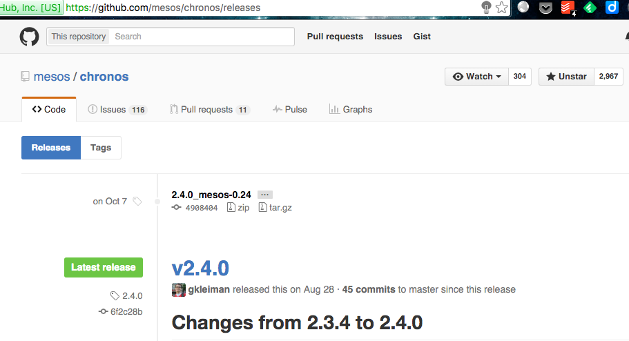

# 搭建Chronos服务

在了解了 Chronos 的工作原理和特性后，这里将介绍怎样搭建一个生产环境可用的 Chronos 服务，生产环境可用意味着要实现服务的高可用性。

我们知道 Chronos 将所有需要持久化的数据都存储到了 ZooKeeper 服务中，所以 Chronos 数据的可靠性由 ZooKeeper 服务来保障，由于 Chronos 是单一 Leader 模型，所以本身不存在数据一致性的问题，但是由于 ZooKeeper 服务是分布式的，所以需要保障数据的一致性。

本节首先介绍 Chronos 高可用性模型，然后动手搭建一个高可用的 Chronos 服务，更进一步，我们将 Chronos 作为一个 Marathon App 运行在 Marathon 之上，从而进一步减少对 Chronos 的运维。

## Chronos 高可用性

得益于将所有数据持久化在 ZooKeeper 服务中，Chronos 的高可用性模型非常简单。Chronos 使用 ZooKeeper 来实现服务内部实例之间的 Leader 选举，任意时刻只有一个服务实例作为 Leader 提供服务，其它实例均作为跟随者，虽然可以接受请求，但是并不对请求进行处理，而是简单的转发，Chronos 会监听 Leader 改变事件，实时知道当前的 Leader 实例。

下图是一个高可用性的 Chronos 服务在生产环境中运行的示例：


Chronos 的高可用性非常简单，在任意时刻只需要有一个 Chronos 实例在运行即可提供服务，所以，由两个实例组成的 Chronos 服务即可提供高可用服务。

## 搭建 Chronos 服务

在编写本书之时，Chronos 最新发布的稳定版本是 2.4.0，并且支持 Mesos 0.24.0，而当前 Mesos 最新的稳定版本是 0.25.0，所以这里我们将搭建 Chronos-2.4.0_mesos-0.25.0，所以需要重新基于 Mesos 0.25.0 编译 Chronos。

### 编译 Chronos

首先，从 mesosphere 或者 GitHub 上下载 Chronos-0.24.0_mesos-0.24.0 源码包，这里以从 GitHub 下载为例，如下图所示：



这里我们下载 tar.gz 格式的包，假设下载到了本地的 `~/Downloads` 目录下。

接下来，执行下面的命令解压下载好的代码包。

```
$ tar xzf chronos-2.4.0_mesos-0.24.tar.gz
$ cd chronos-2.4.0_mesos-0.24
```

解压完成后，修改 `pom.xml` 文件中的第 34 行

```
<mesos-utils.version>0.24.0</mesos-utils.version>

修改为

<mesos-utils.version>0.25.0</mesos-utils.version>
```

`mesos-utils` 是 Mesosphere 为 Scala 提供的编译包，感兴趣的读者可以前往其项目主页：https://github.com/mesosphere/mesos-utils 了解更多。

现在，可以编译 Chronos-0.24.0_mesos-0.25 了，这里我们介绍两种编译 Chronos 的方法，一种是传统的将其编译成 jar 包的方式，一种是直接构建出 Chronos Docker 镜像。

#### 编译 Chronos Jar

Chronos 使用 Maven 来编译，所以首先需要安装配置好 Maven 以及 JDK，这里不再赘述，读者可以参考 Maven 及 JDK 官方文档。

设置好 Maven 和 JDK 之后，运行 mvn 命令编译项目，如下：

```
$ mvn clean package
```

上面的命令表示执行两个 mvn task: clean 和 package，前者会清除之前构建的文件，后者会重新执行一次编译。

编译完成后，会在当前目录生成一个 target 目录，并且在这里可以找到构建好的 Chronos jar 包。

#### 编译 Chronos Docker 镜像

另一种编译 Chronos 的方式，是将 Chronos 直接编译成可启动的 Docker 镜像，在 chronos-0.24.0_mesos-0.24 目录中，可以找到一个 `Dockerfile` 文件，直接在本目录下运行 `docker build` 命令即可直接构建出 Chronos 的镜像，例如：

```
$ docker build -t chronos:0.24.0_mesos-0.25 .
```

不过，读者首先需要在次机器上安装 Docker 环境，构建完成后，即生成了一个镜像，可以使用 `docker images` 查看，输入如下：

```
$ docker images
FIXME: output
```

不管以何种方式编译 Chronos，在完成之后，就可以启动 Chronos 了。

### 运行单个 Chronos 服务

#### 本地运行 Chronos

在编译好 Chronos 之后，就可以启动 Chronos 服务了，执行 chronos-0.24.0_mesos-0.24 目录下的 `bin/start-chronos.sh` 即可，例如：

```
$ ./bin/start-chronos.sh
FIXME: output
```

启动后，Chronos 会默认监听在 8080 端口接收服务请求，可以通过 `netstat` 命令查看：

```
$ FIXME: command line and output
```

在继续之前，我们先看看以 Docker 方式怎样启动 Chronos 服务。

#### 以 Docker 的方式

如果用 Docker 的方式启动 Chronos 服务，非常简单，使用 `docker run` 命令即可，例如：

```
$ docker run -p8080:8080 --name=chronos chronos:0.24.0_mesos-0.25
FIXME: output
```

这里使用了两个 `docker run` 的参数：

  - `-p`, 映射容器内部指定端口到主机指定端口
  - `--name`, 制定容器名称，这里为 chronos

Chronos 默认会监听 8080 端口，这里我们将其映射到主机端口 8080，所以在启动 Chronos 容器之前，首先需要确保主机的 8080 端口没有被占用，否则将失败。

#### 验证 Chronos 服务

在以任何一种方式启动了 Chronos 服务之后，使用浏览器打开本地的 8080 端口地址，例如：`http://127.0.0.1:8080`，可以看到 Chronos Web 用户界面，如下图所示：


Chronos 的使用将在下节较为详细的介绍，这里暂且略过，下面继续介绍怎样配置 Chronos 运行参数。

### Chronos 配置参数

Chronos 有许多配置参数可以用来修改其默认行为，这里介绍一些比较常用的参数。

参数 | 默认值 | 含义
--- | ------ | ---
`--decline_offer_duration <arg>`| 5 秒 | 设置过滤被拒绝的 Mesos Offer 的时间，单位为毫秒，如果不设置，则采用 Mesos 默认的过滤时间 5 秒
`--disable_after_failures  <arg>` | 0 | 设置在任务失败多少次之后，禁止任务，默认为不禁止
`--failover_timeout  <arg>` | 604800 秒，即一周 | 设置 Chronos 框架 failover 的时间超时；在 Mesos 中，如果框架异常失败，则会设置一个 failover 超时，如果在次时间内恢复，则还可以重新注册并且获取到失败之前的任务状态
`--failure_retry  <arg>` | 60000 毫秒 | 设置任务失败重试的时间间隔，默认为 60000 毫秒，即 60 秒
`--graphite_group_prefix  <arg>` | 空 | 设置 Chronos metrics 导出到 Graphite 中的路径前缀，Graphite 是一个基于时间的数据存储，非常适合存储运行状态数据，Chronos 也支持将运行数据发送到 Graphite，以便查看历史运行状态
`--graphite_host_port  <arg>` | 空 | 设置 Graphite 主机和端口，格式为 `host:port`
`--graphite_reporting_interval  <arg>` | 默认值 60 秒 | 设置汇报运行数据的时间间隔，单位为秒
`--hostname  <arg>` | 本机 `hostname` | 设置可访问的主机名，一定要能够被其它 Chronos 实例访问，否则当本实例作为 Leader 时，其它实例不能转发请求到本实例
`--http_credentials  <arg>` | 空 | 设置 HTTP basic 认证使用的用户名和密码，格式为：`user:password`
`--job_history_limit  <arg>` | 5 | 设置显示任务的历史数量
`--master  <arg>` | local | Mesos 服务地址
`--mesos_checkpoint` | 否 | 设置是否开启框架的 checkpoint，推荐开启
`--mesos_framework_name  <arg>` | 空 | 设置本框架的名称，默认值将有 chronos 加版本号组成，例如：chronos-2.4.0
`--mesos_role  <arg>` | * | 设置框架的 role，role 是 Mesos 的属性，用来将框架归类，从而实现资源的隔离，默认的 role 为 `*`，即不使用特殊 role，即共享资源的 role
`--mesos_task_cpu  <arg>` | 0.1 | 任务申请的 CPU 量，可以在每个任务中设置
`--mesos_task_disk  <arg>` | 256 | 任务申请的磁盘量，可以在每个任务中设置，单位为 MB
`--mesos_task_mem  <arg>` | 128 | 任务申请的内存，可以在每个任务中设置，单位为 MB
`--task_epsilon  <arg>` | 60 | 设置任务错过时间，单位为秒，在调度时，如果任务应该启动的时间早于当前时间超过这里设置的时间，将忽略任务的本次调度
`--user  <arg>` | root | Chronos 运行该任务是的权限，可见，默认的 root 权限非常开放，如果 mesos-slave 以 root 权限运行，那么一不小心可能执行了错误的任务，导致计算结点被破坏，或者如果 mesos-slave 以非 root 权限运行，显然任务启动会失败，所以，推荐使用 Chronos 时，只以 Docker 的方式提交任务
`--zk_hosts  <arg>` | localhost:2181 | ZooKeeper 服务的地址，Chronos 使用 ZooKeeper 来存储所有持久化数据
`--zk_path  <arg>` | /chronos/state | Chronos 在 ZooKeeper 中使用的存储路径，Chronos 将把所有数据存储在该目录下
`--zk_timeout  <arg>` | 10000，即 10 秒 | ZooKeeper 操作的超时时间

在了解了上表中常用的 Chronos 参数后，我们知道，上一小节中启动的 Chronos 没有做任何配置，所以它会以本地方式运行，所以实际上没有任何用处，接下来我们将对 Chronos 进行一些配置，并且结合上一章介绍的 Mesos 生产环境和 ZooKeeper 生产环境，搭建高可用，可用于生产环境的 Chronos 服务。

### 搭建高可用 Chronos 服务

在搭建高可用 Chronos 服务之前，首先改进 Chronos 的配置，使其符合生产环境需求，
也就是至少需要修改 `--master` 和 `--zk_hosts` 的配置为生产环境。

这里仍然使用在上一章中搭建的 mesos 集群和 ZooKeeper
服务作为生产环境，所以这里我们将一下面的命令启动
Chronos。这里以使用命令行方式启动为例，假设我们在 192.168.1.101 机器上启动
Chronos。

```
$ ./bin/start-chronos.sh --master zk://192.168.1.101:2181,192.168.1.102:2181,192.168.1.103:2181 \
> --zk_hosts 192.168.1.101,192.168.1.102,192.168.1.103
FIXME: output
```

上面的 `--master` 和 `--zk_hosts` 都使用了同一组 ZooKeeper
服务，这并不是必须的。

为了简单，这里我们没有配置其它可选参数，读者可以按照需求自行配置。

在启动了一个 Chronos 实例后，Chronos 就可以提供服务了，Chronos
在高可用方面实现原理和 Marathon 类似，都使用了 ZooKeeper
作为持久化存储服务，只要在任意时刻有一个实例在运行即可提供服务。

所以，要搭建高可用的 Chronos 服务，非常简单，在其它机器上以同样的配置，启动多个
Chronos 即可。

这里假设在 192.168.1.102 上再启动一个 Chronos，这样就实现了高可用。

## 将 Chronos 运行在 Marathon 上


## 小结

本节介绍了 Chronos 高可用模型，怎样搭建高可用的 Chronos 服务，以及将 Chronos 运行在 Marathon 之上，进一步提高可用性，降低对 Chronos 的维护成本。
