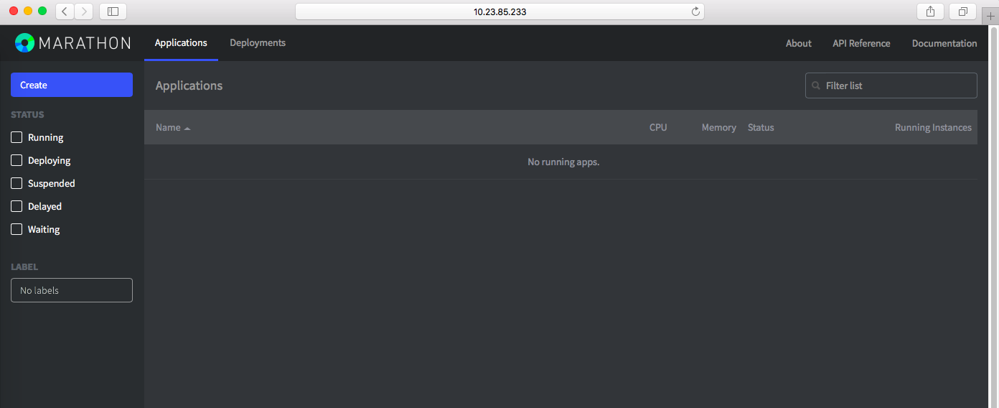

# 搭建Marathon服务

在编写本书时，Marathon 最新的稳定版本是 0.13.0，所以这里将以 Marathon 0.13.0
版本为例来搭建 Marathon 服务。

## 准备环境

Marathon 是运行在 Mesos 之上的长时任务处理框架，并且依赖 ZooKeeper
服务来持久化数据，所以在开始搭建 Marathon 服务之前，首先需要有可用的 Mesos
集群以及 ZooKeeper 服务。

这里我们将使用在前一章中搭建的 Mesos 集群以及 ZooKeeper 服务，虽然 Mesos
也是基于此 ZooKeeper 服务，但是这里纯属巧合，Marathon 可以使用任何其它可用的
ZooKeeper 服务。

所以，Mesos 集群的地址为：
`zk://10.23.85.233:2181,10.23.85.234:2181,10.23.85.235:2181/mesos`；
ZooKeeper 服务地址为：
`zk://10.23.85.233:2181,10.23.85.234:2181,10.23.85.235:2181`。

这里，我们选择在 10.23.85.233 上搭建 Marathon 服务，也就是 Mesos
集群中的其中一台，我们在上一章中称为 A 的机器，这里我们继续称之为 A。

之所以选择 A，并没有什么特殊的原因，读者也可以选择在 B 或者 C 上安装 Marathon，方法和这里相同，只是需要注意的是：安装 Marathon 首先要安装 Mesos，因为 Marathon 依赖于 Mesos 库，所以不能在一台没有安装 Mesos 的机器上安装 Marathon。

## 下载 Marathon

首先，到 Github 上下载 Marathon，下载地址为：https://github.com/mesosphere/marathon/releases/tag/v0.13.0。

假设将 Marathon 下载到了 ~/Downloads 目录下，或者执行下面的命令进行下载：

```
$ cd ~/Downloads
$ curl -O http://downloads.mesosphere.com/marathon/v0.13.0/marathon-0.13.0.tgz
```

使用下面的命令解压下载好的压缩包

```
$ tar xzf marathon-0.13.0.tgz
$ cd marathon-0.13.0
$ ls
bin  Dockerfile  docs  examples  LICENSE  README.md  target
```

执行解压后的 `bin/start` 脚本即可启动 marathon，如下所示：

```
$ ./bin/start --master zk://10.23.85.233:2181,10.23.85.234:2181,10.23.85.235:2181/mesos \
> --zk zk://10.23.85.233:2181,10.23.85.234:2181,10.23.85.235:2181/marathon
```

上面命令中有两个参数：

  - `--master`, 指定 Mesos 集群控制结点服务地址
  - `--zk`, 指定 ZooKeeper 服务地址
  
上面的命令可能会报如下错误：

```
MESOS_NATIVE_JAVA_LIBRARY is not set. Searching in /usr/lib /usr/local/lib.
MESOS_NATIVE_LIBRARY, MESOS_NATIVE_JAVA_LIBRARY set to ''
Exception in thread "main" java.lang.UnsupportedClassVersionError: mesosphere/marathon/Main : Unsupported major.minor version 52.0
        at java.lang.ClassLoader.defineClass1(Native Method)
        at java.lang.ClassLoader.defineClass(ClassLoader.java:803)
        at java.security.SecureClassLoader.defineClass(SecureClassLoader.java:142)
        at java.net.URLClassLoader.defineClass(URLClassLoader.java:449)
        at java.net.URLClassLoader.access$100(URLClassLoader.java:71)
        at java.net.URLClassLoader$1.run(URLClassLoader.java:361)
        at java.net.URLClassLoader$1.run(URLClassLoader.java:355)
        at java.security.AccessController.doPrivileged(Native Method)
        at java.net.URLClassLoader.findClass(URLClassLoader.java:354)
        at java.lang.ClassLoader.loadClass(ClassLoader.java:425)
        at sun.misc.Launcher$AppClassLoader.loadClass(Launcher.java:308)
        at java.lang.ClassLoader.loadClass(ClassLoader.java:358)
        at sun.launcher.LauncherHelper.checkAndLoadMain(LauncherHelper.java:482)
```

`Unsupported major.minor version 52.0` 这个错误表示 Marathon 是使用 Java 1.8 编译的，并且不兼容老版本，而本机上安装的 Java 版本为 1.7.0，所以执行时才会出现错误。

解决办法就是升级本机的 Java 版本，或者从源码编译安装 Marathon，升级 Java 版本很简单，直接通过 YUM 从 CentOS 软件源中安装即可。

```
# yum install -y java-1.8.0-openjdk
```

安装完成后，再次运行上面的命令，可以看到，已经不再报这个错误了，但是，可能会报下面的错误。

```
Failed to load native Mesos library from
Exception in thread "pool-1-thread-2" java.lang.UnsatisfiedLinkError: Expecting an absolute path of the library:
        at java.lang.Runtime.load0(Runtime.java:806)
        at java.lang.System.load(System.java:1086)
        at org.apache.mesos.MesosNativeLibrary.load(MesosNativeLibrary.java:159)
        at org.apache.mesos.MesosNativeLibrary.load(MesosNativeLibrary.java:188)
```

这是因为 Marathon 没有找到 Mesos 库导致的，修复这个问题也很简单，设置一个环节变量，再启动 Marathon 即可，如下：

```
$ MESOS_NATIVE_JAVA_LIBRARY=/usr/lib64/libmesos.so ./bin/start --master zk://10.23.85.233:2181,10.23.85.234:2181,10.23.85.235:2181/mesos --zk zk://10.23.85.233:2181,10.23.85.234:2181,10.23.85.235:2181/marathon
```

如果用户直接从 Mesosphere 软件源中安装 Mesos 包，则不会发生这个错误，因为 Mesosphere 的安装包将 Mesos 库安装到了 /usr/local/lib 下。

启动完成后，打开浏览器访问本机的 `8080` 端口，就可以看到 Marathon UI 了，如下图所示：



Marathon 启动后，会将自己注册到 Mesos 集群中，并且将数据持久化到 `--zk` 指定的
ZooKeeper 服务中的指定地址。

现在，打开 Mesos 服务的 Web UI，就可以看到刚刚注册的 Marathon
服务了，如下图所示：


到现在为止，一个可用的 Marathon 服务就搭建起来了，非常简单，Marathon
还有一些可配置的参数，这里介绍一些读者可能会用到的参数。

## Marathon 参数

marathon 只有一个必须的参数，即 `--master`，以便知道 Mesos 的服务地址。
其它一些比较常用的可选参数如下表所示：

参数					 |默认值					|示例					 |含义
------------------------|-------------------------|-------------------------|-----
`--zk` | 无 | `--zk=zk://host1:port1,host2:port2,host3:port3/path` | 指定 ZooKeeper 服务地址，指定后 marathon 将会使用 ZooKeeper 作为持久化存储后端
`--[disable_]checkpoint`|`--checkpoint`		   |`--checkpoint `		  |是否开启任务 checkpoint， 开启 checkpoint 后，在 mesos-slave 重启或者 marathon failover 期间，任务会继续运行；注意：开启 checkpoint 必须在 mesos-slave 相应地开启 checkpoint，如果关闭，则任务会在 mesos-slave 重启或者 marathon failover 期间失败
`--failover_timeout` | 604800 | `--failover_timeout=86400` | 设置 mesos-master 允许 marathon failover 的时间，如果 marathon 没有在此时间内恢复，mesos 将删除 marathon 的任务
`--hostname` |主机的 hostname | `--hostname=10.23.85.233` | 如果你的机器主机名没有被正确配置，很可能需要手动指定，否则可能导致 marathon 不能和 mesos 通信，或者不能和其它 marathon 服务实例通信
`--mesos_role` | 无 | `--mesos_role=marathon` | 设置其在 mesos 中的 role，mesos 的资源预留和共享机制建立在 role 之上，默认不指定 role 的框架具有的 role 为 `*`，表示使用共享资源，注意：这里指定的 role 必须是在 mesos-master 中指定的 `roles` 中的值
`--default_accepted_resource_roles` | 所有资源 | `--default_accepted_resource_roles=marathon` | 接受具有指定 role 类型的资源，注意，所有资源类型都必须具有指定 role，例如：cpus(marathon):20;mem(*):20480; 将不被接受，因为内存只有 `*` 资源，而没有 `marathon` 资源
`--task_launch_timeout` |300000, 5 分钟| `--task_launch_timeout=1800000` |设置任务启动时间，也就是从提交任务到任务进入 RUNNING 的时间，通常来说，如果需要进行比较长的准备时间，需要将该值增大，例如：从 docker-registry 下载镜像
`--event_subscriber` | 无 | `--event_subscriber=http_callback` | 设置开启的事件订阅模块，目前只支持 `http_callback` 一种类型，开启后，marathon 将接受用户的事件订阅，并且相应地在发生事件时，回调注册的 http_callback，并且将事件内容以 JSON 的方式传递给 http_callbak
`--http_address` | 所有网络地址 | `--http_address=10.23.85.233` | 监听的网络地址，通常来说，Linux 系统中都会有一个本地回环 IP: 127.0.0.1，往往映射到主机名 localhost，只能通过本机访问，另外，还有至少一张配置好的网卡和其它主机通信，例如：10.23.85.233
`--http_credentials` | 无 | `--http_credentials=admin:adminpass` | marathon basic auth 的用户名和密码
`--http_port` | 8080 | `--http_port=80` | marathon 服务监听的端口
`--http_max_concurrent_requests` | 无 | `--http_max_concurrent_requests=100` | 最大并发请求数，当请求队列超过该值时，直接返回 503 错误代码，如果 marathon 服务并发很大，那么为了避免服务不稳定或出现故障，最好设置该值，以便客户端收到失败返回后重试

Marathon 的参数还可以通过环境变量来配置，这和 Mesos 类似，只需要将参数全部大写，并且加上 MARATHON_ 前缀，例如：

- `--zk` 参数可以通过环境变量 `MARATHON_ZK` 来指定
- `--mesos_role` 可以通过环境变量 `MARATHON_MESOS_ROLE` 来指定

需要注意的是，如果一个参数同时通过环境变量指定，又通过命令行参数指定，那么命令行参数将会覆盖环境变量。

## 服务的高可用性

在上一节中，我们了解了 Marathon 高可用性实现方案，Marathon
将所有需要持久化的数据都存储在 ZooKeeper 服务中，并且多个实例之间由 ZooKeeper
来实现 Leader Election。所以，实现高可用性不需要任何配置即可完成。

但是，对于 Marathon 用户来说，Marathon 这种高可用性却不是透明的，因为，当
Marathon Leader 故障时，新的 Leader 提供的服务地址和以前的 Leader
服务地址不一样，所以用户需要更改访问的地址。

所以，对用户透明的高可用性就非常有需要了，特别是对于通过 HTTP
协议来访问的用户来说。

下面将介绍两种实现透明高可用性的方案：

  - 虚拟 IP 方案
  - 负载均衡方案

### 虚拟 IP 方案

虚拟 IP 方案基于 VRRP (Virtual Router Redundancy Protocol) 协议，VRRP 的工作原理如下：


简单的说，有两个设备同时提供一个虚拟 IP，两个设备采用主备的方式工作，
任意时间只有一个设备提供虚拟 IP，当主机点故障时，备用结点提供虚拟 IP，
当主节点恢复时，主节点提供虚拟 IP。所以，主节点总是优先。

Linux 下常见的实现虚拟 IP HA 的软件有：

  - keepalived
  - ucarp
  - heartbeat

回顾一下 Marathon HA 的工作原理可以知道，这种主备工作方式的 HA 并不适合
Marathon，包括后面将要介绍的 Chronos，它具有和 Marathon 相同的 HA 实现方式。

原因是在 Marathon 服务中，所有跟随者实例都需要将请求转发给
Leader，所以，当 Marathon Leader 运行在 keepalived 或者 ucarp 中的备用结点上时，
所有的请求都需要经过转发才能到达 Marathon Leader，降低了效率。

举个例子：假设有 A, B 两台服务器，使用 keepalived 实现了 IP HA，并且配置了 A
服务器作为主结点，B 作为备结点。同时在 A, B 两天服务器上搭建了 Marathon 服务，
服务启动时，A 结点上的 Marathon 作为 Leader，所以所有通过虚拟 IP
到达的请求都直接由 Marathon Leader 处理，但是，假设某一时刻服务器 A 故障宕机，
显然，服务器 B 上的 Marathon 会作为新的 Marathon Leader 并且所有通过虚拟 IP
到达的请求都将直接到达 B，此时所有的请求也是直接由 Marathon Leader
处理的，看起来一切工作的非常好。

但是，过了一段时间后，服务器 A 恢复了，重新上线，由于 A 被配置成了虚拟 IP
的主结点，所以当 A 在线时，所有对虚拟 IP 的访问都将发往 A，但是，此时服务器 A
上的 Marathon 并非 Leader，所以，Marathon 收到请求后，需要将请求转发给服务器 B
上的 Marathon Leader，直到下次 B 上的 Marathon 故障，将服务器 A 上的 Marathon
重新选举为 Leader。

简单的说，只有当虚拟 IP 主结点和 Marathon Leader
是同一个结点时，才能避免服务转发。

### 负载均衡方案

负载均衡器顾名思义是用来实现各个服务器之间负载均衡的设备，包括软硬件设备，在软件定义以及开源软件大行其道的今天，可选的开源负载均衡软件也不少，最常见的有：

  - LVS(Linux Virtual Server)
  - HAProxy
  - Nginx

负载均衡器器由于可以通过心跳来检查后端服务器的健康状况，所以，也能够在实现负载均衡的同时，
也实现服务的高可用性，负载均衡器能够根据配置的心跳检测策略检查后端服务器，
并且避免将流量继续发往故障的后端服务器。

使用负载均衡器和使用 IP HA 方式相比，几乎总是有一半的流量会通过 Marathon
跟随结点转发到 Marathon Leader 结点上，不会太坏，也不会太好。

当然，这里介绍的是最简单的配置情况下，读者可以通过一些编程，实现动态配置，从而避免转发，
这里不再赘述，留给读者自行研究。
