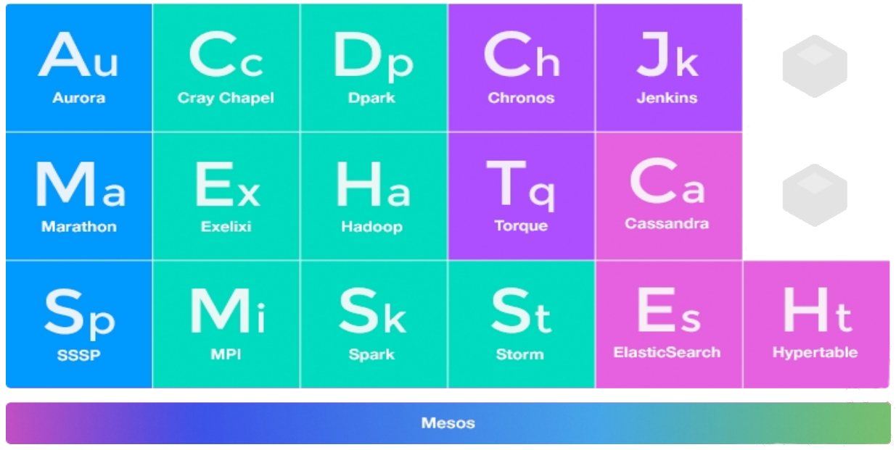

# Mesos 框架概览

从上一章我们知道，移植一个现有的分布式计算框架到 Mesos 平台难度并不高，所以
Mesos 生态迅速得到了其它已有分布式计算框架的支持，下图是 Mesosphere
社区文档中发布的一张框架元素周期表，大概概括了目前能够完美运行在 Mesos 之上的计算框架。

Mesosphere 官方宣称有超过 40 个计算框架支持 Mesos。

在上图中，按照颜色将框架分为了 4 类，从左到右：

  - PaaS 或者长时任务框架
  - 大数据框架
  - 短任务或者批处理框架
  - 数据存储框架

同时，Apache Mesos 官方文档也有对支持 Mesos 的计算框架的简单介绍。

## PaaS 或者长时任务框架

上图中的左边第一列既是 PaaS 或者长时任务框架，包括 Aurora, Marathon 和 SSSP。

### Aurora

Aurora 最初由 Twitter 开发，后来贡献给 Apache 软件基金会，目前已经成功 Apache
顶级项目。

Aurora 是专门为运行在 Mesos 之上开发的，而非移植到 Mesos 的框架，
它实际上支持两类任务：长时任务和批处理任务，虽然这里将其归类为 PaaS
或者长时任务框架。

Aurora 的核心特性包括：

  - 平滑的升级及回滚
  - 资源配额以及多用户支持
  - 强大的 DSL 描述语言
  - 服务发现

Aurora 的任务配置非常灵活，强大，但也稍显复杂，所以目前在国内的用户并不多。

### Marathon

Marathon 是 Mesosphere 专门为 Mesos 开发的长时任务框架，根正苗红，目前是 Mesos
平台上使用最广泛的 PaaS 框架。Marathon 目标是成为 Mesos 集群中的类似 init
进程之于操作系统的功能，能够启动长时任务，并且保证长时任务总是在线。

根据 Marathon 的特点，Mesosphere 也推荐将其它框架使用 Marathon 来运行，
这样其它框架就能够更简单的实现高可用性，失败转移等特性，降低运维成本。
本章将会有专门的篇幅来介绍 Marathon，所以这里就此打住。

### SSSP

SSSP 即 S3 Proxy Mesos Framework 是一个 Amazon S3 存储的 Proxy，由 Mesosphere
开发并开源，由于 S3 在国内并不可用，所以这里不对 SSSP
做介绍；另外，此项目也已经停止开发近两年，所以没有必要再对其进行介绍。

## 大数据框架

### Cray Chapel

Cray Chapel 是一种并行编程语言，最初为高性能并行计算开发，后来逐步改善兼容性，
现在也能运行在常见的支持类 Linux 系统上。

Cray Chapel on Mesos 调度框架则实现了将使用 Chapel 编写的应用运行在 Mesos
集群中。

### Exelixi

Exelixi 是一个将基因算法应用运行在 Mesos 集群中的框架。

### MPI

MPI (Message Passing Interface)
是一种并行计算消息通信接口，主要面向高性能并行计算，MPI on Mesos
框架主要是能够让 MPI 运行在 Mesos 集群中。

### Dpark

Dpark 是国内公司豆瓣开发的，使用 Python 语言重新实现了 Spark，支持 Map-Reduce
任务，并且在 GitHub 上开源。

### Hadoop

Hadoop 应该是当前大数据领域炙手可热的计算框架了，开发灵感来自于 Google 公布的
Map-Reduce 论文，Hadoop 项目包含了许多子项目，是一个完整的大数据解决方案生态，
最基础的莫过于分布式文件系统 HDFS 和 Map-Reduce 计算框架，Hadoop 也是一个 Apache
软件基金会的顶级项目，并且其生态圈中，有非常多的子项目同时也是 Apache
软件基金会顶级项目。

Hadoop on Mesos 项目能够将 Hadoop 运行在 Mesos 集群中，但是随着 YARN(Map-Reduce
v2) 的发布，Hadoop on Mesos 的进度就转移到了怎样将 YARN 运行在 Mesos 之上，
并且在 Apache 软件基金会孵化了一个项目: Apache Myriad，目前发布了 0.1 版本。

### Spark

Spark 是一个 Apache 软件基金会顶级项目，是另一个非常活跃的大数据计算框架，
支持 Map-Reduce 任务，得益于基于内存的计算模型，Spark 宣称运行速度在
Hadoop Map-Reduce 百倍以上；即使基于磁盘计算，速度也在 Hadoop Map-Reduce
十倍以上。

值得一提的是，Spark 可谓是 Mesos 的同门，最初都有伯克利 AMPLab 创建，Spark
发展到现在，已经不仅仅支持 Map-Reduce 任务了，还支持 Spark SQL, Spark Streaming
实时流式计算，MLlib 机器学习以及 GraphX 图计算。

### Concord

Concord 是一个基于 Mesos 的实时流计算框架，和 Apache Storm 类似。

### Storm

Storm 是 Apache 软件基金会的顶级项目，面向实时流计算。

## 短任务或者批处理框架

### Chronos

Chronos 是一个目前比较活跃的 Mesos 批处理任务框架，最初由 Airbnb 开发，目前由
Mesosphere 维护，Chronos 类似于分布式的 Cron，它支持 ISO8601 标准的定时任务，
以及支持优先级，同步、异步任务，任务依赖等等。

### Jenkins

Jenkins 是老牌 Continuous Integration(CI) 开源软件，使用非常广泛，
本书也有专门的实战案例介绍怎样使用 Jenkins + Mesos 搭建可扩展的可持续集成服务。

### Torque

Torque 虽然出现在了元素周期表中，但是由于基本上处于无维护状态，
所以已经不推荐使用了。

## 数据存储框架

### ElasticSearch

ElasticSearch 更为出名的是作为 ELK(ElasticSearch, Logstash, Kibana) 的一员，
ELK 被广泛应用在日志采集、处理、分析、检索、报表领域。

### Cassandra

Cassandra 同样是一个 Apache 软件基金会的顶级项目，提供分布式，
可先行扩展的数据存储服务，并且支持跨数据中心的冗余。

### Hypertable

Hypertable 是一个开源的分布式数据库软件，设计理念来源于 Google Bigtable，
着眼于可扩展性，可扩展性也是目前 NoSQL 相对于 SQL 数据库的主要优点之一，
但随之妥协的往往是稍差的性能和一致性。

Hypertable 号称在扩展性，性能以及一致性方面都做得非常出色。
