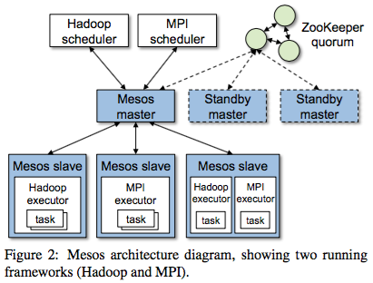
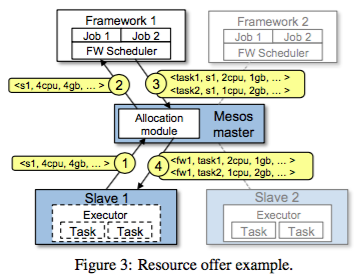

# Mesos 怎样工作

本节将简单介绍下 Mesos 是怎样工作的，以及通过简单的实例来展示 Mesos 的魔力。
更多更具深度，难度的真实用例将在本书其它章节详细介绍。

## Why Mesos

简单回顾下计算机界的发展历程，可以发现一些规律，例如：CPU 的发展是单核 CPU
主频越来越高，计算能力越来越强，然后当单核计算能力越来越难于提高时，多核 CPU
迎难而上，继续提高着单个计算结点的计算能力，但是当单个计算结点计算能力越来越难于提高，
或者说成本越来越高时，分布式计算迎难而上。

而当各种分布式计算框架越来越流行时，问题出现了，各个框架独自占有各自的计算集群，
即使在任务不多或者没有任务时，资源依然不能被其它框架共享。究其原因，大概主要有以下几方面。

### 集群搭建复杂，配置管理难度大

集群搭建复杂，配置难度大，主要在于如果将多个计算框架部署在一个集群上，
一旦集群结点达到几十甚至上百个，那么配置管理的难度将非常大，并且指数上升。

### 硬件可能定制化

由于各个计算框架都是针对一定使用场景设计的，所以其任务的类型也具有一定模式，例如：
当前流行的 Hadoop, Spark, Storm 等计算框架，各自都有自己擅长的计算类型；相应地，
资源需求类型也不同：Hadoop 需要高性能的磁盘 I/O 以便加速 MapReduce 读写的速度，
Spark 需要大容量内存因为其将计算中间结果都存放在内存中，而 Storm
则没有类似特要求。

所以，为了更加节省计算资源，充分利用资源，硬件可能定制化，例如：给 Hadoop
集群配备 SSD，给 Spark 集群配置大容量内存等。

所以，定制化的硬件并不能很好的适用于其它计算框架。

### 计算框架间资源抢占，影响稳定性

即使将多个框架搭建在同一个集群中，由于各个框架是独立的，互相间并不知道各自的状态，
那么很可能出现资源抢占，甚至冲突，例如：框架 A 和 B 可能同时提交大量任务，
导致集群资源不够用，发生 OOM 等严重错误，甚至同时访问相同的资源，例如：
访问同一个文件，这将导致更严重的错误。

### 计算框架间任务隔离性差

单个框架独占集群时，由于整个集群的资源都归单个框架调度，所以，
能够灵活的调度各个任务到各个结点运行，即使任务间采用最简单的进程隔离，问题也不大。

但是，如果是多个框架，那么隔离性差，很可能导致框架间的任务互相影响，例如：
两个框架的两个任务依赖的库文件版本不一样，或者库之间有冲突等等，这时，
简单的进程隔离完全不能解决问题，需要文件系统的隔离。

在细数了为什么不能很好的将多个分布式计算框架运行在同一个集群之上后，我们回到起点：
为什么要将多个框架运行在一个集群中呢？

在提出这个疑问时，我们潜意识里就已经承认了多个分布式计算框架共享集群能够更好的利用资源。
在著名的 Mesos 论文中，几位作者也通过详尽的建模，编码，测试，分析验证了这个结论。

所以这里我们不再论述这个问题，假设读者接受了这个事实：集群共享比独占集群更节省资源。

## Mesos 怎样工作

首先，引用一下 Mesos 论文中的 Mesos 架构图，FIXME：如果不能直接引用，可以重画。



图中显示了 MPI 和 Hadoop 框架同时运行在 Mesos 之上的情景，图中所示 Mesos 集群由
3 个控制结点和 3 个计算结点组成，并且所依赖的 ZooKeeper 服务也由 3 个实例组成。

在某一个时刻，一个计算结点上可能会同时运行着 MPI 和 Hadoop 的任务。而 MPI 和
Hadoop 都通过 Mesos 控制结点来分发任务，而不是直接向计算结点分发任务。

在 Mesos 环境中，运行于 Mesos 之上的框架不再直接管理集群中的计算结点，
以及直接分发任务，而是通过 Mesos
控制结点来获取当前可用的资源，然后将任务和资源组合发送给 Mesos 控制结点，
由控制结点代为分发。

这样，Mesos 控制结点唯一控制整个集群的所有资源，具有全局资源试图，
能够协调上层运行的多个计算框架，从而实现集群资源有序共享，而不会导致资源抢占甚至冲突。

在任务隔离上，基于 Linux Controll Groups, Mesos 可以做到多方面的隔离，
保证各个任务在一个良好的隔离环境中运行；值得一提的是：Mesos
支持当前最为流行的容器技术 Docker，Docker CTO 曾公开表示 Mesos 是 Docker
的黄金搭档。

在理解了 Mesos 架构图之后，我们再深入一点，看看 Mesos 是怎样管理资源的。



1. 计算节点向控制结点汇报可用资源
2. 控制结点汇集当前可用的资源，并以 offer 的方式发送给计算框架
3. 计算框架根据收到的资源，调度自己的任务
4. 控制结点解析计算框架发送的任务，并调度到计算节点中执行

看起来很简单，对吗？我们稍微深入一点实现细节。

### 汇报可用资源

如果读者观察过 mesos-slave 的日志文件，可以看到 mesos-slave
在启动时会自动获取当前机器可用的资源，包括：

  - CPU 核数
  - 内存大小
  - 磁盘大小
  - 网络端口

如下为 A 机器上 mesos-slave 启动时的相关日志示例。

```
FIXME: log output
```

从上面的日中中，我们可以知道，在 A 机器上，mesos-slave 表明自己可用的资源为

  - CPU: 8 核
  - 内存：FIXME MB
  - 磁盘：FIXME MB
  - 网络端口：FIXME

这是 mesos-slave 自动检测的结果，如果有需要，我们可以手动配置，例如：
在我们上一节的实例中，我们可以指定一半的资源给 mesos-slave 使用，那么就可以保证
mesos-master 有足够的资源运行。

指定计算资源通过配置 mesos-slave 的 `--resources` 参数实现，格式为：

```
name(role):value;name(role):value...
```

其中，`name` 是资源的名称，mesos 内置了以下几种资源：

  - cpus
  - mem
  - disk
  - ports

分别对应 CPU，内存，磁盘和网络端口。另外，CPU
和内存是必须资源，缺少其中任何一种都不能运行任务。例如：可以指定 A
机器的资源为：

```
cpus(foo):2;mem(foo):2048;cpus(*):2;mem(*):6144
```

这里我们只指定了两种必须的资源：CPU 和内存，其它资源将以自动检测的为准。
除了 Mesos 内置的资源外，还可以指定用户自定义的资源，mesos
同样会将用户定义的资源发送给计算框架，从而调度任务。

注意：修改资源配置只要在重启 mesos-slave 后才生效。

### 发送 Offer

计算节点在启动时，会向控制节点汇报可用资源，而控制节点则会将计算结点加入到注册表中，
并且将可用资源记录在案，并且在适当的时候根据调度算法将资源以 Offer
的方式发送给上层运行的计算框架。

每个 Offer 代表一个计算节点上的可用资源，所以，为了提高效率，
控制结点往往会一次性将多个 Offer 发送给一个框架，以便框架能够批量调度任务。

查看 mesos-master 的日志，我们可以看到这种事件，例如：

```
FIXME: log output
```

上面的日志显示 mesos-master 向框架 FIXME 发送了 2 个 Offer。那么，这两个 Offer
是什么样的呢？我们可以到框架的日志中查看，例如：

```
FIXME: log output
```

可以看到，一个 Offer 就是一个计算结点在某一时刻对当前框架的所有可用资源。
这里，需要注意一些限定：

  - 一个计算结点，也就是说 Offer 和计算结点是一对一的关系
  - 当前框架，也就是即使是在同一时刻，各个框架看到的 Offer
    可能是不同的，因为计算结点可能为某些角色预留资源，配置不同的资源等
  - 所有可用资源，即总是可以断定，mesos
    不会将一个计算结点对某个框架可用的资源分成不同的 Offer 来发送，
    原因很明显，因为会导致碎片

### 调度任务

当计算框架收到 Offer 时，便可以根据 Offer
来调度任务了，例如：有两个任务需要运行，分别为：

  - 任务 A: 2 个 CPU，1GB 内存
  - 任务 B: 1 个 CPU, 2GB 内存

收到的 2 个 Offer 为：

  - Offer 1: 1.5 个 CPU, 5GB 内存
  - Offer 2: 2 个 CPU, 2GB 内存

那么，调度框架如果先调度 A（可能 A 的优先级比 B 的高），会发现 Offer 1
不满足需求，所以可能首先拒绝掉 Offer 1，然后检查 Offer 2，发现可用，
那么就会组装一个任务，并且声明这个任务使用了 Offer 2 的 2 个 CPU, 1GB 内存；
然后，继续调度任务 B，发现 Offer 2 已经不够了，而且已经没有更多 Offer 了，
所以这一轮调度就只能调度一个任务。

很显然，这里并没有最优调度，因为任务 B 是可以使用 Offer 1 的，但是 Offer 1
却被拒绝掉了。

这里只是一个简单的任务调度示例，真实的调度算法可以非常复杂，非常高效。

当计算框架完成了本轮调度后，就会把组装好的任务发送给控制结点。

### 启动任务

控制结点在收到任务后，会打开任务，看看这个任务使用的 Offer，并且更新相应的
Offer，减去将要被使用的资源，然后将任务发送到 Offer
中指定的计算结点，我们知道，Offer 是何计算结点一一对应的。

计算结点在收到任务后，就会按照指示，启动任务，并且为任务设置好资源限制，
以免任务使用超标的资源。

接下来，控制节点需要向控制结点汇报任务的状态，如果任务完成，
那么控制结点就会回收这个任务使用的资源，并且更新相应的 Offer。

这样，一个任务的生命周期就完成了，Mesos
就这样周而复始的动态的管理着整个集群的运转。

## 小结

本节简单的剖析了 Mesos 的工作原理，希望对读者在阅读后面的实战章节有些帮助，
本节内容抛砖引玉，只揭开了 Mesos 神秘面纱的一角，更多的秘密需要读者更多实践，
更多的学习去解开。

在下一章，我们将介绍几个 Meoss 生态圈中最常见的计算框架，以及一些基础用例，
以便读者能更好的理解后续实战章节的内容以及创造自己的实战案例。
